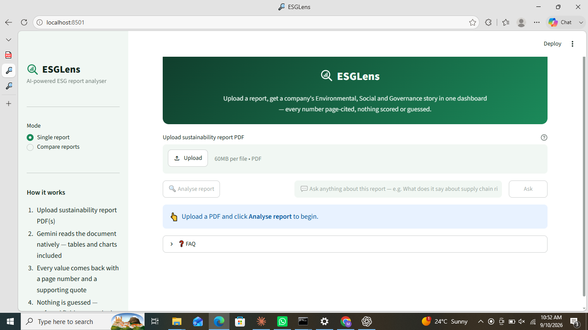
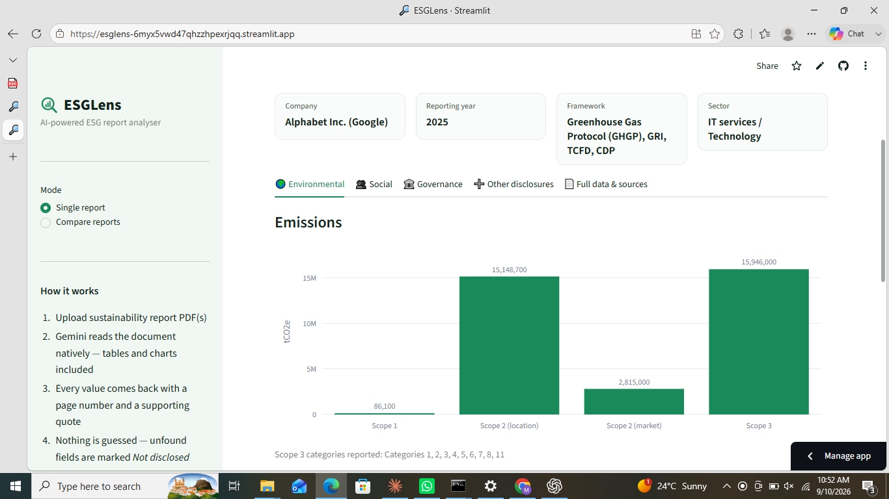

# 🔎 ESGLens

**Live demo:** https://esglens-6myx5vwd47qhzzhpexrjqq.streamlit.app/

An AI-powered tool that extracts structured, **page-cited** ESG data from
sustainability report PDFs — built on the Gemini API's native document
understanding, not a text-chunking RAG pipeline.

## What it does

- Reads any GRI report, BRSR filing, CDP disclosure, or integrated annual report
- Extracts Scope 1–3 emissions, energy, water, waste, workforce diversity,
  safety (LTIFR/TRIR), board composition, policies and more — organised into
  an Environmental / Social / Governance dashboard with charts
- Gives every value a **page number and a supporting quote** (page numbers
  follow the report's own printed numbering, not your PDF viewer's page count)
- Marks anything it can't find as **"Not disclosed"** rather than guessing
- Flags **conflicting values** within a single report instead of silently picking one
- Catches material disclosures outside the fixed field list in an
  **"Other disclosures"** catch-all, so nothing gets silently dropped
- Compares **2–5 reports side by side**, with comparability warnings when
  reporting years, sectors or frameworks differ
- Automatically retries with backoff on transient/per-minute rate limits,
  and can rotate across several free-tier API keys to work around Gemini's
  very low daily request cap (see "About the free tier" below)
- Never computes an overall "ESG score" — the extracted evidence speaks for itself

## Screenshots




---

## Run it — step by step

### 1. Get a free Gemini API key

Go to [aistudio.google.com/apikey](https://aistudio.google.com/apikey), sign
in with a Google account, and create a key. No billing/credit card needed
for the free tier.

### 2. Install Python dependencies

From inside the `esglens` folder:

```bash
pip install -r requirements.txt
```

### 3. Add your key to `secrets.toml`

The app reads your key from `.streamlit/secrets.toml` only — there's no
box in the app to type it into, so it never ends up on screen or in a
screenshot. Copy the template and fill it in:

```bash
cp .streamlit/secrets.toml.example .streamlit/secrets.toml
```

Then open `.streamlit/secrets.toml` in a text editor and replace the
placeholder with your real key:

```toml
GEMINI_API_KEY = "paste-your-real-key-here"
```

Save the file. It's listed in `.gitignore`, so it will never be committed
or pushed to GitHub even if you `git add .`.

### 4. Run the app

```bash
streamlit run app.py
```

This opens `http://localhost:8501` in your browser. Upload a PDF, click
**Analyse report**, and the dashboard builds itself.

### 5. Stopping / restarting

`Ctrl+C` in the terminal stops the server. Run `streamlit run app.py`
again any time to restart — your key stays saved in `secrets.toml`, so
you won't need to re-enter anything.

---

## Deploying to Streamlit Community Cloud (optional, for a public link)

1. Push the `esglens` folder to a **public** GitHub repo — `secrets.toml`
   won't come along, because it's gitignored.
2. On [share.streamlit.io](https://share.streamlit.io), create a new app
   pointing at your repo, branch `main`, main file `app.py`.
3. Under **Advanced settings → Secrets**, paste:
   ```toml
   GEMINI_API_KEY = "paste-your-real-key-here"
   ```
   This is the only place your real key should ever live outside your own machine.
4. Deploy. You'll get a public URL for your resume/LinkedIn/applications.

---

## About the free tier

Google's free tier for `gemini-3.8-flash` currently allows only **~20
requests per day, per Google Cloud project** (this dropped sharply — from
250/day — in a Dec 2025 quota change), plus a per-minute request/token
throttle. Requests-per-day resets at **midnight Pacific Time**. ESGLens
uses exactly **one Gemini request per report** (single mode = 1 request;
comparing 3 reports = 3 requests), so a single analysis rarely bumps into
it — but the daily cap can matter if you're comparing several reports or
iterating a lot in one day.

- If a **per-minute** throttle or a dropped connection happens, ESGLens
  **retries automatically** with backoff — you'll see a live "waiting Xs"
  message in the status box.
- If a key hits the **daily** cap, retrying won't help until the reset, so
  ESGLens doesn't try — it fails fast with a clear message instead of
  burning time on retries that can't succeed.
- **Multiple keys:** since the cap is per *project*, not per key, and a
  fresh Google account normally gets its own project, you can add several
  free-tier keys (e.g. one per personal Google account) via
  `GEMINI_API_KEYS` in `secrets.toml` — see `.streamlit/secrets.toml.example`.
  ESGLens rotates to the next configured key automatically the moment one
  hits its daily cap, giving you N independent 20/day budgets instead of one.
- Enabling Cloud Billing on an API project (Google AI Studio → your
  project → Billing) raises these limits substantially, even if your
  actual usage stays within Google's free monthly credit.

## A note on accuracy

Page citations make every extracted value easy to double-check, and the
model is explicitly instructed never to guess a figure that isn't written
down — but no automated extraction is infallible. Treat ESGLens as a fast,
well-cited first pass, not a substitute for reading the cited page
yourself before relying on a number for a real decision.

## Project structure

```
esglens/
├── app.py                       # Streamlit UI — single-report & compare modes
├── analyser.py                  # Gemini extraction engine, schema, comparability checks
├── requirements.txt
├── .streamlit/
│   ├── config.toml              # theme
│   └── secrets.toml.example     # copy to secrets.toml, never commit the real one
├── .gitignore
├── .esglens_key_state.json      # auto-created; tracks which API key(s) hit today's cap
└── README.md
```

## Built by

Farman — Environmental Engineering graduate, building AI tools for ESG and
carbon data analytics.
